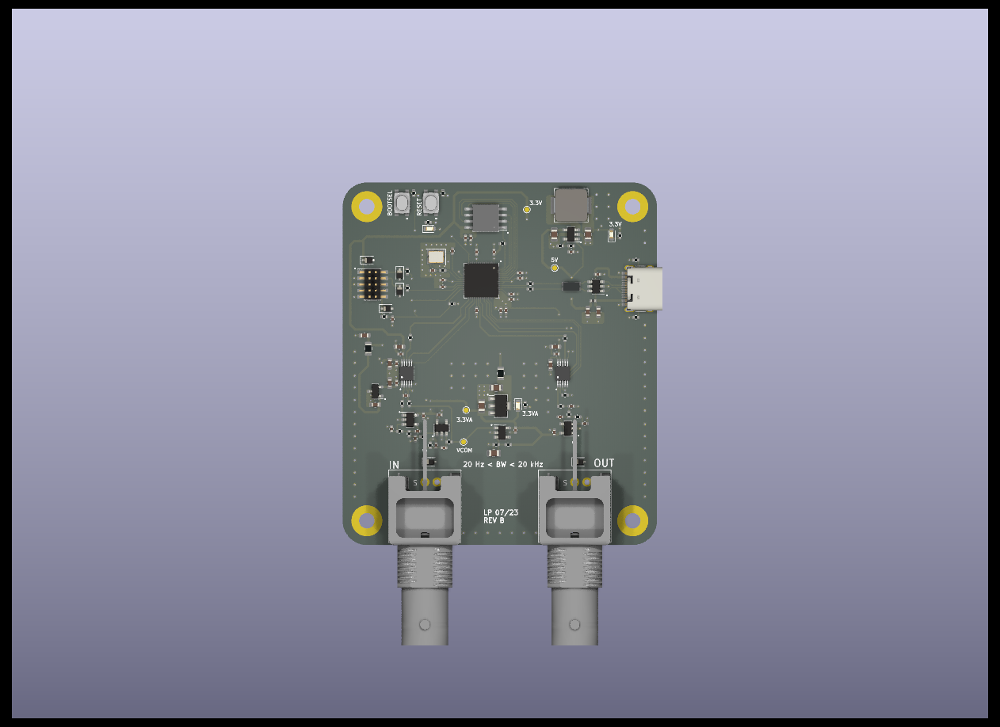

# rp2040_audioboard
Mixed signal audio board using the rp2040:

For an interactive KiCad experience see:
[RP2040 Audioboard](https://kicanvas.org/?github=https://github.com/lzptr/rp2040_audioboard/tree/main/hardware).

This project is a variation of the board from phils lab mixed signal course (https://www.phils-lab.net/courses).
It's purpose is to serve as a general input/output signal analyzer/generator for audio projects.